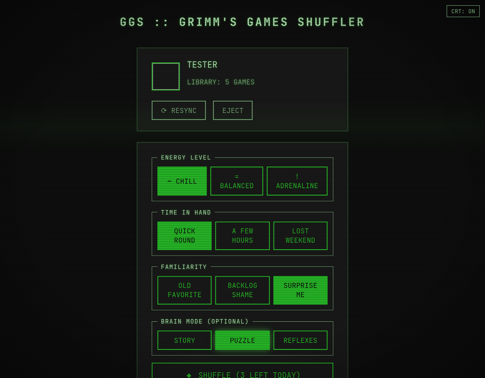
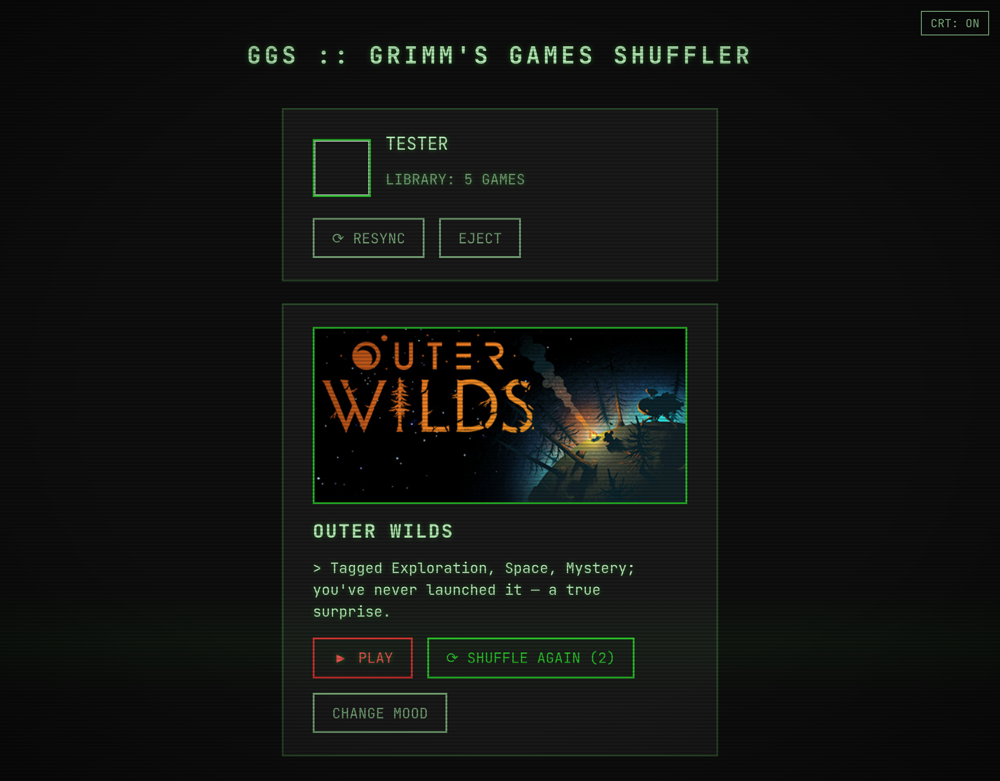

# GGS — Grimm's Games Shuffler

**You have 900 games and nothing to play.** GGS picks one from your Steam
library based on your current mood — and tells you why.

Answer four chunky questions (energy, time, familiarity, brain mode), hit
SHUFFLE, get a game. Three Shuffles per day, no repeats, backlog favored
over comfort picks. Optionally let an LLM do the picking; by design it's
garnish, never a dependency.

Live at **[games.grimm0.dev](https://games.grimm0.dev)**, or self-host it —
one binary, one SQLite file.

| Mood questionnaire | Shuffle result |
| --- | --- |
|  |  |

## How it works

- **Sync** with Steam via OpenID — GGS learns your SteamID and imports your
  library (game details must be public on your Steam profile).
- Game metadata comes from a **Seed Catalog** embedded in the binary
  (the most-owned Steam games, pre-fetched from SteamSpy), and the long tail
  of your library is enriched in the background at SteamSpy-friendly rates.
- Your **Mood** filters the library deterministically; if nothing matches,
  filters relax one by one and the result says so. A weighted random pick
  favors games you've barely touched.
- Every result comes with a **Why**. Non-AI mode templates it from tags and
  playtime; AI mode asks an LLM to pick from the same candidates and write
  the Why — and falls back to the deterministic path on any failure.
- **3 Shuffles per day** per player, resetting at UTC midnight, never the
  same game twice in a day.

## Self-hosting

GGS is a single container: Go binary with the React frontend embedded,
SQLite on a volume — no external services required.

```sh
docker build -t ggs .
docker run -d --name ggs \
  -p 8080:8080 \
  -v ggs-data:/data \
  -e BASE_URL=https://games.example.com \
  -e STEAM_API_KEY=your-key \
  ggs
```

| Variable | Required | Default | Purpose |
| --- | --- | --- | --- |
| `BASE_URL` | for login | — | Public URL of your instance; Steam OpenID redirects back to it |
| `STEAM_API_KEY` | for login | — | [Steam Web API key](https://steamcommunity.com/dev/apikey) used to import libraries |
| `OPENROUTER_API_KEY` | no | — | Enables the AI picker ([OpenRouter](https://openrouter.ai)); without it GGS runs fully non-AI |
| `GGS_AI_MODEL` | no | `meta-llama/llama-3.3-70b-instruct:free` | OpenRouter model slug for the AI picker |
| `PORT` | no | `8080` | Listen port |
| `DATA_DIR` | no | `/data` | Where `ggs.db` lives |

The server starts without any of these and serves the UI; login stays
disabled until `BASE_URL` and `STEAM_API_KEY` are set.

## Development

Go 1.26+, pnpm, [sqlc](https://sqlc.dev) and golangci-lint.

```sh
make dev    # everything: fresh fake session + backend :8080 + Vite HMR on :5173
make run    # backend only (pair with `cd web && pnpm dev`)
make check  # lint + race tests + sqlc diff + frontend build — the pre-push gate
make build  # production binary with embedded frontend
```

`make dev` needs no Steam credentials: it reseeds `./.data` with a fake
player, session and library (`make seed` to do just that). Open
`http://localhost:5173` and set the cookie in the devtools console:

```js
document.cookie = 'ggs_session=testtoken'
```

`cmd/seedgen` regenerates the embedded Seed Catalog from SteamSpy.

The architecture is hexagonal (`internal/domain`, `internal/adapter`,
`internal/dto`, `internal/handler`); the domain language lives in
[CONTEXT.md](CONTEXT.md) and the load-bearing decisions in
[docs/adr](docs/adr).

## License

[MIT](LICENSE)
